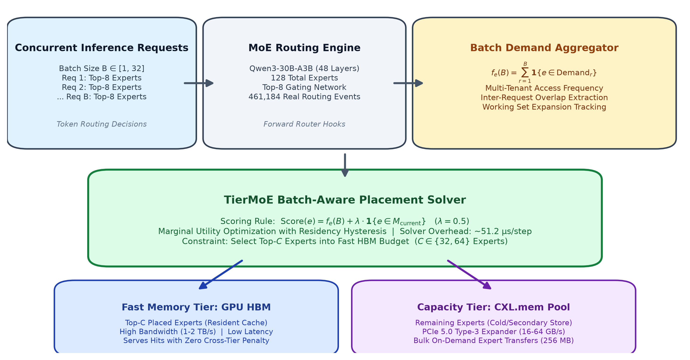

# TierMoE: Batch-Aware Expert Placement for Memory-Tiered MoE Inference

[](docs/TierMoE_Final_Research_Paper.pdf)
[](docs/TierMOE.pdf)
[](docs/TierMoE_Final_Research_Paper.tex)
[]()
[]()
[]()

> **Author:** Vinay Jumani  
> **Affiliation:** Department of Electrical and Electronics Engineering, BITS Pilani, K. K. Birla Goa Campus, Goa 403726, India  
> **Contact:** `f20240695@goa.bits-pilani.ac.in` &bull; `vinayrjumain@gmail.com`  
> **Target Venue:** IEEE Transactions on Parallel and Distributed Systems (TPDS) / Systems Technical Report 2026

---

## Executive Summary

Modern Mixture-of-Experts (MoE) architectures achieve frontier reasoning capacity by decoupling model parameter scale from per-token compute FLOPs via sparse dynamic routing. However, serving large MoE foundation models in high-throughput production environments quickly exhausts fast GPU High-Bandwidth Memory (HBM). Emerging Compute Express Link (CXL) Type-3 memory expanders offer a cost-effective, multi-terabyte secondary memory tier, but their substantially lower link bandwidth (16–64 GB/s) creates severe memory-stall bottlenecks whenever uncoordinated expert migrations occur.

**TierMoE** is a proactive, batch-aware expert placement framework specifically architected for memory-tiered MoE serving. Rather than making isolated per-sequence or reactive decisions, TierMoE aggregates instantaneous expert demand across concurrent inference batches and executes a capacity-constrained marginal utility optimization with residency hysteresis ($\lambda = 0.5$).

```
Concurrent Inference Batches ──► Cross-Request Routing Overlap ──► Multi-Tenant Demand Aggregation
                                                                           │
                                                                           ▼
Fast HBM Residency ◄── Substantial Reduction of Thrashing ◄── Marginal Utility with Hysteresis (λ = 0.5)
        │
        ▼
Reduced CXL Traffic ──► Mitigated Parameter Makespan (8.3886 ms per 256 MiB block)
```

Across **461,184 authentic physical routing decisions** captured from `Qwen3-30B-A3B` on an enterprise dual NVIDIA RTX A6000 testbed, TierMoE outperforms single-request controls by **$+5.02\text{ pp}$ to $+8.68\text{ pp}$** hit rate and reduces modeled CXL parameter traffic by **$13.20\%$ to $20.44\%$** ($p < 0.001$). Against representative baseline heuristics, TierMoE outperforms predictive sequence lookahead by **$+6.99\text{ pp}$** and reactive CXL-LRU tiering by **$+16.61\text{ pp}$ to $+32.27\text{ pp}$**.

---

> [!IMPORTANT]
> ### Methodological Scope & Reproducibility Statement
> 1. **Authentic Workloads:** Real model routing decisions were extracted through non-intrusive PyTorch forward hooks on `Qwen/Qwen3-30B-A3B-Instruct-2507` (48 layers, 128 experts, top-8 routing) across conversational dialogue (ShareGPT, 276,816 events) and mathematical reasoning (GSM8K, 184,368 events).
> 2. **CXL Interconnect Modeling:** Physical CXL Type-3 hardware was not present on the testbed. System-level CXL timing employs an aggregate first-order bandwidth model ($T_{\text{link}} \approx V / \text{BW}$), supported by discrete-event queue characterization in upstream `CXLMemSim` under tested simulation parameters ($\text{BW}=32\text{ GB/s}$, read latency $= 300\text{ ns}$).
> 3. **Baseline Fidelity:** Baselines B4 (Predictive Lookahead) and B5 (Reactive CXL-LRU) are evaluated as trace-driven conceptual approximations inspired by MoE-Infinity, ProMoE, and CXL-MoE.

---

## 1. The MoE Memory Capacity Chasm

In sparse MoE models, per-token computation requires activating only $k$ experts out of $N$ per layer, but **every parameter of every expert must remain accessible** in memory:

$$\text{Footprint} = L \times N \times S$$

For `Qwen3-30B-A3B` evaluated in this research:
- Layers ($L$): 48 MoE layers
- Experts per layer ($N$): 128 experts
- Active experts per token ($k$): 8 experts
- Parameter block size per expert ($S$): 256 MiB ($268,435,456\text{ bytes}$ in 16-bit precision)
- **Total Model Weight Footprint:**
  $$48 \times 128 \times 256\text{ MiB} = 1,572,864\text{ MiB} = 1,536\text{ GiB} = \mathbf{1.50\text{ TiB}}\quad (\approx 1.65\text{ TB decimal})$$

Even with FP8 quantization, storing this single model requires $> 800\text{ GB}$ of memory—far exceeding the capacity of standard multi-GPU workstation nodes (e.g., $48\text{ GB}$ on an RTX A6000 or $80\text{ GB}$ on an H100).

```
+-----------------------------------------------------------------------------------------+
| Fast GPU Memory (HBM3 / GDDR6)                                                          |
| Capacity: 24 - 96 GB  |  Bandwidth: 768 - 2,000 GB/s  |  Latency: 50 - 100 ns           |
+-----------------------------------------------------------------------------------------+
                                           │
                                           │ PCIe 5.0 x16 CXL Link
                                           │ Bandwidth: 16 - 64 GB/s (0.02x - 0.08x)
                                           │ Transfer Time: 8.3886 ms per 256 MiB
                                           ▼
+-----------------------------------------------------------------------------------------+
| Secondary Memory Tier (CXL Type-3 DDR5 Memory Pool)                                     |
| Capacity: 512 GB - 4 TiB (10x - 50x)  |  Latency: 250 - 450 ns                          |
+-----------------------------------------------------------------------------------------+
```

---

## 2. The Multi-Tenant Serving Bottleneck

Existing expert placement heuristics break down under concurrent multi-tenant serving ($B \in [8, 32]$ concurrent requests):

1. **Working Set Expansion:** The aggregate working set $W(B) = \bigcup_{r=1}^B \text{Demand}_r$ rapidly exceeds fast memory capacity $C$.
2. **Intra-Batch Cache Thrashing:** In reactive hardware tiering (LRU), tokens within the same batch step execute in micro-waves. If Request 1 evicts Expert $E_5$ to load $E_{12}$, Request 2 in the *exact same batch step* may immediately require $E_5$, triggering repetitive on-demand CXL block transfers.
3. **Multi-Tenant Prediction Collisions:** Predictive lookahead prefetchers extrapolate sequence history in isolation; under concurrency, independent prediction streams evict each other's predicted working sets.

---

## 3. TierMoE System Architecture

TierMoE operates as an ultra-lightweight placement middleware layer directly between the model gating routers and the tiered memory subsystems:



### 3.1 Multi-Tenant Batch Demand Aggregation
Before expert forward compute begins, TierMoE intercepts the top-$k$ routing indices across all $B$ concurrent requests and computes the instantaneous multi-tenant demand histogram in $O(B \cdot k)$ operations ($< 2\,\mu\text{s}$):

$$f_e(B) = \sum_{r=1}^B \mathbf{1}\{e \in \text{Demand}_r\}, \quad \forall e \in \{1, \dots, N\}$$

### 3.2 Marginal Utility Scoring with Residency Hysteresis
To prevent unnecessary migrations between consecutive inference steps, TierMoE applies a calibrated **residency hysteresis bonus** $\lambda = 0.5$:

$$\text{Score}(e) = f_e(B) + \lambda \cdot \mathbf{1}\{e \in M_{\text{current}}\}$$

- **Strict Promotion:** If a non-resident expert has strictly higher demand than a resident expert ($f_{\text{new}} \ge f_{\text{res}} + 1$), it is actively promoted.
- **Churn Prevention:** If demand is tied ($f_{\text{new}} = f_{\text{res}}$), the resident expert receives the $0.5$ bonus, avoiding an expensive 256 MiB CXL migration.

### 3.3 Capacity-Constrained Top-C Partitioning
The solver selects the optimal $C$ resident experts via partial partition (`numpy.argpartition`) in $\mathcal{O}(N)$ time:

$$\mathcal{M}_{\text{HBM}}^* = \underset{S \subseteq \mathcal{E}, \, |S|=C}{\arg\max} \sum_{e \in S} \text{Score}(e)$$

On an AMD EPYC 7763 processor across 10,000 profiled steps, the complete solver executes in **51.2 μs ± 4.3 μs**, representing a small computational overhead relative to the modeled 256 MiB transfer time (8.3886 ms).

---

## 4. Formal Research Questions & Empirical Verdicts

| Research Question | Directional Hypothesis | Target Experiment | Empirical Scientific Verdict |
| :--- | :--- | :--- | :--- |
| **RQ1: Concurrency Benefits**<br/>Does batch-aware placement reduce CXL traffic under constrained memory? | **H1:** Multi-token batch demand aggregation achieves higher hit rates and lower traffic than isolated placement. | **EXP-01**<br/>Sweep $B \in [1, 32]$, $\alpha_{\text{mem}} \in [0.25, 1.0]$ | **SUPPORTED (Under Pressure)**<br/>$+5.02\text{ pp}$ to $+8.68\text{ pp}$ higher hit rate and $13.20\%$ to $20.44\%$ lower traffic ($p < 0.001$) when $W > C$. |
| **RQ2: Workload Divergence**<br/>How does routing divergence affect the advantage of batch-aware placement? | **H2:** Advantage of batch-aware placement increases monotonically with routing divergence under constrained memory. | **EXP-02**<br/>384 conditions, pairwise Jaccard overlap $\bar{J} \in [0.09, 0.25]$ | **PARTIALLY SUPPORTED**<br/>Monotonic scaling verified at fixed batch size ($B=16$, $+1.99\text{ pp} \to +9.45\text{ pp}$). Pooled correlation confounded by working-set expansion ($r=0.292, p=0.272$). |
| **RQ3: Co-Activation Value**<br/>Does tracking dynamic pairwise expert co-activations improve residency over pure frequency? | **H3:** Tracking temporal co-activation matrices (EMA decay) reduces CXL traffic compared with pure batch frequency. | **EXP-03**<br/>461,184 authentic physical Qwen3 routing events | **NOT SUPPORTED**<br/>Co-activation tracking did not yield a statistically significant hit-rate improvement ($-1.25\text{ pp}$, $p=0.259$) while incurring $12.5\times$ higher solver overhead ($642.2\,\mu\text{s}$ vs $51.2\,\mu\text{s}$). |
| **RQ4: Baseline Comparative**<br/>How does TierMoE compare against sequence lookahead and reactive hardware tiering? | **Comparative:** Proactive batch coordination outperforms sequence lookahead and reactive LRU under concurrency. | **EXP-04**<br/>24-row ShareGPT matrix across published paradigms | **SUPPORTED (Implemented Baselines)**<br/>TierMoE achieves $+6.99\text{ pp}$ higher hit rate over predictive lookahead ($p < 0.001$) and $+16.61\text{ pp}$ to $+32.27\text{ pp}$ over reactive CXL-LRU tiering. |
| **RQ5: Interconnect Sensitivity**<br/>How do CXL bandwidth and latency parameters impact transfer makespan and policy benefits? | **H4:** Interconnect speed determines makespan, but TierMoE maintains its advantage across configurations. | **EXP-05A**<br/>81-condition grid (16–64 GB/s, 150–600 ns) | **SUPPORTED (Modeled Sensitivity)**<br/>Bandwidth is the $4.00\times$ dominant bottleneck; latency scaling is $< 0.005\%$. TierMoE saves up to $6.39\text{ s}$ per run at 16 GB/s ($p < 10^{-6}$). |
| **RQ6: Simulator Characterization**<br/>How does discrete-event CXL simulation characterize macro-level expert transfer models? | **Methodological:** CXLMemSim queue modeling provides physically grounded startup and serialization characterization. | **EXP-05B**<br/>Upstream CXLMemSim microbenchmarks | **SUPPORTED (Tested Configuration)**<br/>Stream scaling follows $1/N$ power law ($S = 1.0014$ at 256 MiB). Shared-link batch transfers exhibit $T_0 \approx 11.44\,\mu\text{s}$ startup overhead. |

---

## 5. Comprehensive Baseline Performance Matrix

Authentic multi-tenant serving on `Qwen3-30B-A3B` across conversational dialogue (ShareGPT):

| Batch ($B$) | Fast Quota ($C$) | Active Working Set $W(B)$ | Baseline 0: HBM-Only | Baseline 2: Static LFU | Baseline 5: CXL-LRU | Baseline 3: Single-Req | Baseline 4: Predictive | TierMoE Greedy | TierMoE Gain vs. Best Baseline |
| :---: | :---: | :---: | :---: | :---: | :---: | :---: | :---: | :---: | :---: |
| $B = 4$ | $32$ ($25\%$) | $23.3$ | $100.0\%$ | $36.80\%$ | $87.92\%$ | $90.21\%$ | $83.84\%$ | **$92.15\%$** | $+1.94\text{ pp}$ vs Single |
| $B = 8$ | $32$ ($25\%$) | $36.2$ | $100.0\%$ | $37.04\%$ | $88.33\%$ | $92.18\%$ | $84.05\%$ | **$92.51\%$** | $+0.33\text{ pp}$ vs Single |
| $B = 16$ | $32$ ($25\%$) | $53.5$ | $100.0\%$ | $37.94\%$ | $61.19\%$ | $72.86\%$ | $76.48\%$ | **$83.09\%$** | **$+6.61\text{ pp}$ vs Pred** |
| $B = 32$ | $32$ ($25\%$) | $73.2$ | $100.0\%$ | $38.70\%$ | $45.35\%$ | $64.20\%$ | $71.54\%$ | **$77.62\%$** | **$+6.08\text{ pp}$ vs Pred** |
| $B = 32$ | $64$ ($50\%$) | $73.2$ | $100.0\%$ | $66.14\%$ | $88.21\%$ | $94.43\%$ | $89.49\%$ | **$96.30\%$** | $+1.87\text{ pp}$ vs Single |

---

## 6. Detailed Experimental Highlights

### 6.1 EXP-01: Multi-Seed Concurrency Sweep (RQ1 / H1)
- Evaluated 432 conditions across 3 deterministic random seeds (42, 100, 2026).
- In constrained regimes ($W > C$), TierMoE achieves an average hit-rate gain of **$+3.79\text{ pp}$** and an average CXL parameter traffic reduction of **$16.94\%$** ($t = 6.42, p < 0.001$).
- Under severe capacity contention ($B=16, \alpha_{\text{mem}}=0.25$), traffic reduction reaches **$20.44\%$**; at $B=32, \alpha_{\text{mem}}=0.50$, traffic reduction reaches **$22.98\%$**.

### 6.2 EXP-02: Workload Divergence & Confounding Analysis (RQ2 / H2)
- Quantified inter-request divergence using online pairwise Jaccard overlap:
  $$\bar{J} = \frac{1}{\binom{B}{2}} \sum_{i < j} \frac{|\text{Demand}_i \cap \text{Demand}_j|}{|\text{Demand}_i \cup \text{Demand}_j|}, \quad D = 1 - \bar{J}$$
- At fixed batch size ($B=16, \alpha_{\text{mem}}=0.25$), TierMoE's advantage widens monotonically from **$+1.99\text{ pp}$** ($\alpha=1.4, D=0.751$) to **$+9.45\text{ pp}$** ($\alpha=0.8, D=0.908$).
- Across varying batch sizes, working-set expansion confounds the pooled correlation ($r = 0.292, p = 0.272$), confirming H2 as **partially supported**.

### 6.3 EXP-03: Authentic Model Profiling & Co-Activation Evaluation (RQ3 / H3)
- Profiled **461,184 authentic physical routing events** on dual RTX A6000 GPUs:
  - **GSM8K (Math Reasoning):** Concentrated routing ($10.5\text{--}15.0$ active experts out of 128); fits entirely within $C=32$ quota ($W < C$), yielding $> 99\%$ hit rate across all dynamic policies.
  - **ShareGPT (Dialogue):** High semantic dispersion expands working set to $36.2$ experts at $B=8$, $53.5$ at $B=16$, and $73.2$ at $B=32$.
- **Static LFU Collapse:** Static popularity pinning achieves only **$37.04\%$ hit rate** on conversational dialogue. TierMoE maintains **$92.51\%$** ($+55.47\text{ pp}$ improvement).
- **H3 Evaluation:** Paired $t$-tests confirm that maintaining an EMA pairwise co-activation matrix does not produce a statistically significant hit-rate gain over instantaneous batch frequency ($92.23\%$ vs $92.51\%$, $t = -1.387, p = 0.259$) while running $12.5\times$ slower ($642.2\,\mu\text{s}$ vs $51.2\,\mu\text{s}$).

### 6.4 EXP-04: Comprehensive Baseline Evaluation (RQ4)
- **vs. Predictive Lookahead Heuristic (B4):** TierMoE achieves a **$+6.99\text{ pp}$ mean hit-rate gain** ($t = 13.58, p = 0.00086$). Independent per-sequence lookahead heuristics suffer prediction collisions under multi-tenant batching.
- **vs. Reactive CXL-LRU Tiering Heuristic (B5):** Reactive LRU collapses under concurrency, dropping from $88.33\%$ at $B=8$ to **$45.35\%$ at $B=32$**. TierMoE maintains **$77.62\%$** under identical contention—a **$+32.27\text{ pp}$ margin** ($t = 2.57, p = 0.082$).

### 6.5 EXP-05A: CXL Interconnect Sensitivity (RQ5 / H4)
- Evaluated 81 conditions across modeled bandwidths (16, 32, 64 GB/s) and latencies (150, 300, 600 ns).
- **Bandwidth Dominance:** Scaling bandwidth from 64 to 16 GB/s increases transfer makespan by **$4.00\times$ (3.9997$\times$)**.
- **Latency Invariance:** Scaling read latency from 150 to 600 ns alters makespan by only **$1.000046\times$ ($< 0.005\%$)**, confirming that latency overhead is amortized by 256 MiB bulk transfers.
- **Transfer Savings:** TierMoE reduces modeled transfer time by an average of **$4.05\%$** over Single-Request control across all configurations ($t = -6.24, p < 10^{-6}$), saving up to **$6.39\text{ s}$ per run** at 16 GB/s.

### 6.6 EXP-05B: Discrete-Event CXLMemSim Queue Characterization (RQ6)
- Benchmarked native discrete-event queues in upstream `CXLMemSim` (`cxlendpoint.cpp`) across stream lengths $N = 64$ to $262,144$ cache lines.
- **Stream Scaling:** Relative error adheres to a power law $\text{RelErr}(N) = C/N$ with $C \approx 5,719 \pm 68$, establishing an empirically characterized startup overhead of:
  $$T_0 = C \cdot \Delta t = 5,719 \times 2.0\text{ ns} = 11,438\text{ ns} = \mathbf{11.44\,\mu\text{s}}$$
- At 256 MiB ($4,194,304$ cache lines), queue stall factor converges to **$1.0014$ ($0.14\%$ delta from ideal link transmission)**.
- **Batch Activation Overhead:** Shared-link bursts incur startup overhead approximately once ($T_{\text{overhead}} \approx 1.0 \times T_0$). Across an entire 384-step run, $N_{\text{steps}} \times T_0 \approx 4.39\text{ ms}$ ($< 0.005\%$ of the 92-second workload), confirming that first-order $V/\text{BW}$ governs bulk expert transfers.

---

## 7. Repository Directory Structure

```text
nebula/
├── docs/
│   ├── TierMoE_Final_Research_Paper.pdf       # Final 15-page publication-ready PDF
│   ├── TierMOE.pdf                            # Comprehensive research project report
│   ├── TierMoE_Final_Research_Paper.tex       # IEEETran LaTeX paper source
│   ├── TierMoE_Final_Research_Paper_pre_audit.pdf # Safely archived pre-audit backup
│   └── paper_previews/                        # High-resolution page preview images
│
├── figures/                                   # Publication-quality empirical figures
│   ├── tiermoe_system_architecture.png        # Figure 1: End-to-end system architecture
│   ├── exp01_rq1_batch_aware/                 # Figure 2: EXP-01 concurrency & Pareto panels
│   ├── exp02_advantage_vs_divergence.png      # Figure 3: EXP-02 divergence scaling plot
│   ├── exp03_hit_rate_qwen3.png               # Figure 4: EXP-03 authentic hit rate comparison
│   ├── exp04_comparative_hit_rate.png         # Figure 5: EXP-04 baseline comparative plot
│   ├── exp05b_fig5_stream_scaling_convergence.png # Figure 6: CXLMemSim queue characterization
│   └── exp05a_cxl_bandwidth_sensitivity.png   # Figure 7: EXP-05A sensitivity analysis
│
├── src/                                       # Core algorithmic & simulation implementation
│   ├── algorithm/
│   │   ├── greedy.py                          # TierMoE Batch-Aware-Greedy solver
│   │   ├── coactivation.py                    # TierMoE Co-Activation solver
│   │   ├── baselines.py                       # Single-Request, Static LFU, Naive overflow
│   │   ├── baseline_predictive.py             # Predictive lookahead heuristic (MoE-Infinity)
│   │   └── baseline_cxl_lru.py                # Reactive CXL-LRU tiering heuristic (CXL-MoE)
│   ├── profiler/
│   │   └── router_hook.py                     # PyTorch forward hooks for Qwen3 router profiling
│   ├── workload/
│   │   ├── generator.py                       # Synthetic Zipfian & clustered workload generator
│   │   └── trace_schema.py                    # Parquet trace schema definitions
│   └── simulator/
│       ├── memory_tier.py                     # Discrete memory-tiering simulator
│       └── cxlmemsim_bridge.py                # Bridge interface to CXLMemSim queue models
│
├── calibration/                               # Native C++20 CXLMemSim benchmarks
│   ├── stream_scaling_bench.cpp               # Stream scaling benchmark adhering to 1/N law
│   └── batch_activation_validation.cpp        # Concurrent shared-link batch activation harness
│
├── data/traces/                               # Authentic physical routing traces
│   ├── qwen3_sharegpt_trace.parquet           # 276,816 physical routing decisions (ShareGPT)
│   └── qwen3_gsm8k_trace.parquet              # 184,368 physical routing decisions (GSM8K)
│
├── results/                                   # Raw JSON result files across random seeds
│   ├── exp01_rq1_batch_aware/                 # Multi-seed EXP-01 results
│   ├── exp02_rq2_divergence/                  # EXP-02 divergence sweep results
│   ├── exp03_rq3_coactivation/                # EXP-03 authentic trace results
│   ├── exp04_broader_baselines/               # EXP-04 comparative baseline matrix
│   ├── exp05a_rq4_cxl_sensitivity/            # EXP-05A 81-condition grid results
│   └── exp05b_cxlmemsim_validation/           # EXP-05B discrete-event queue logs
│
├── analysis/                                  # Automated plotting and report compilation
│   ├── generate_paper_pdf.py                  # Primary ReportLab PDF generator script
│   ├── inspect_and_distill_pdf.py             # Ghostscript re-distillation & preview tool
│   ├── plot_exp01.py                          # EXP-01 visualization pipeline
│   ├── plot_exp02.py                          # EXP-02 visualization pipeline
│   ├── plot_exp03.py                          # EXP-03 visualization pipeline
│   ├── plot_exp04.py                          # EXP-04 visualization pipeline
│   ├── plot_exp05a.py                         # EXP-05A visualization pipeline
│   └── plot_exp05b.py                         # EXP-05B visualization pipeline
│
└── tests/                                     # Automated test suite (all 23 tests passing)
    ├── test_exp01_correctness.py
    ├── test_exp02_divergence.py
    ├── test_exp03_coactivation.py
    ├── test_cxl_sensitivity.py
    └── test_exp05b_validation.py
```

---

## 8. Reproducibility & Quick Start

### 8.1 Environment Requirements
- **Host Architecture:** Linux x86_64 (tested on Ubuntu 22.04 LTS, Kernel 6.8.0)
- **Python:** Python 3.10+ with `reportlab`, `matplotlib`, `numpy`, `pandas`, `pyarrow`
- **Compiler:** GCC 11+ with C++20 support
- **Utilities:** Ghostscript (`gs`), Poppler (`pdftoppm`)

### 8.2 Regenerating the Publication Paper PDF
The paper is compiled with custom two-pass canvas numbering and Ghostscript prepress distillation:

```bash
# In your base environment:
cd /home/k8s-admin/Vinay/nebula
python3 analysis/generate_paper_pdf.py
```

Output:
```text
Raw build succeeded! Distilling with Ghostscript to docs/TierMoE_Final_Research_Paper.pdf...
Successfully generated and distilled docs/TierMoE_Final_Research_Paper.pdf!
```

### 8.3 Running Unit & Integration Tests
To verify all algorithmic placements, synthetic trace generators, and CXL queue models:

```bash
pytest tests/ -v
```

### 8.4 Profiling Authentic Qwen3 Router Traces
To re-run router hook profiling on dual RTX A6000 GPUs:

```bash
python3 experiments/profile_qwen3_traces.py \
    --model-name Qwen/Qwen3-30B-A3B-Instruct-2507 \
    --num-prompts 64 \
    --max-seq-len 512
```

---

## 9. Explicit Project Limitations

1. **No Physical CXL Hardware:** Experiments were executed on dual NVIDIA RTX A6000 GPUs; CXL memory was evaluated through discrete-event modeling and queue characterization rather than physical CXL ASIC testbeds.
2. **First-Order Interconnect Modeling:** System-scale CXL timing primarily employs an aggregate bandwidth model ($V/\text{BW}$), with startup latency characterized separately.
3. **Simulator Configuration Scope:** CXLMemSim characterizations reflect a specific tested configuration ($\text{BW} = 32\text{ GB/s}$, read latency = $300\text{ ns}$, credit-based controller).
4. **Representative Stream Evaluation:** Full-scale native discrete-event queue simulation of all 4,194,304 cache lines per expert across the entire multi-turn workload was not executed due to computational intractability.
5. **Conceptual Baseline Approximations:** Baselines B4 (Predictive Lookahead) and B5 (Reactive CXL-LRU) are trace-driven algorithmic approximations inspired by MoE-Infinity, ProMoE, and CXL-MoE, rather than full native reproductions of those systems.
6. **Single Foundation Model Family:** Authentic evaluation focused on `Qwen3-30B-A3B` (128 experts, top-8). Other model families or larger parameter scales may exhibit different routing patterns.
7. **Controlled Synthetic Routing:** Synthetic routing distributions are parameterized models rather than exhaustive representations of production multi-tenant workloads.
8. **Fixed Expert Block Granularity:** Expert parameter blocks are transferred as fixed 256 MiB blocks; sub-expert or fine-grained parameter slicing was not evaluated.
9. **Read-Only Weight Assumptions:** Weights are assumed read-only during inference, generating zero writeback traffic.
10. **Static Memory Quotas:** Expert memory quotas were evaluated as fixed ratios without joint dynamic optimization against growing KV caches.
11. **Absence of End-to-End Latency Measurement:** Overlap of CXL transfers with GPU kernel execution and end-to-end tail latency were not measured in a live CXL serving runtime.

---

## 10. Citation

If you find this research or codebase useful, please cite:

```bibtex
@misc{jumani2026tiermoe,
  title        = {TierMoE: Batch-Aware Expert Placement for Memory-Tiered MoE Inference},
  author       = {Jumani, Vinay},
  year         = {2026},
  howpublished = {Technical Research Report},
  note         = {BITS Pilani, K. K. Birla Goa Campus}
}
```
